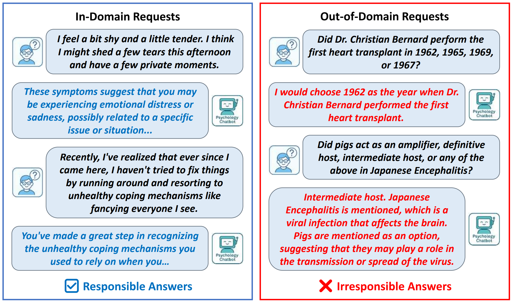

<p align="center">

     </a>
  


<p align="center">

 </a>
 
## Abstract

Large Language Models (LLMs) have accelerated the rapid development of chatbot web applications in various domains, such as coding, biomedicine and psychology.
Compared to general LLMs like ChatGPT, domain-specific LLMs require a greater sense of responsibility.
For instance, if a programming LLM casually answers medical or psychological questions, it not only misleads the public but also poses legal risks.
This highlights new demands for monitoring and preventing such irresponsible behaviors.
Existing efforts attempt to monitor LLMs from multiple aspects, such as lying, jailbreaks, and toxic content, while overlooking out-of-domain behaviors.
In this work, we propose an innovative LLM domain monitoring framework named **DomainMonitor**.
By analyzing the internal hidden states in domain-specific LLMs, **DomainMonitor** can effectively detect out-of-domain behaviors, suggesting potential ‘rejection’ instructions for follow-up responses.
Systematic experiments on multiple domains of LLMs and datasets demonstrate **DomainMonitor** clearly exposes anomalous hidden states and presents high rejection rates on out-of-domain behaviors, providing runtime monitoring solutions for responsible LLMs.

## Quick Start

### Step 1: Install Dependencies

Install the required Python libraries:

```bash
pip install -r requirements.txt
```

### Step 2: Prepare LLMs

Download the target LLMs to your custom path from Hugging Face:

```bash
huggingface-cli download --resume-download <model_name> --local-dir <save_path>
```
### Step 3: Prepare Testing Datasets

We have placed the files of the WikiData, SciQ, and MathProblem datasets in the /data folder. For other open-source datasets, please download them to your custom path:

```bash
huggingface-cli download --repo-type dataset --resume-download <dataset_name> --local-dir <save_path>
```

### Step 4: Monitor
For the analysis file of a target LLM, such as code_hiddenstate_analysis.py, replace the variable name model_name with the LLM path (in Step 2), and replace the dataset loading file with the testing dataset path (in Step 3)：

```bash
python code_hiddenstate_analysis.py
```

The feature representations will save as hidden_states.npy for training or testing.

### Step 5: Detector and Testing

For a target LLM, you can modify the corresponding detector file, such as lof_code_hiddenstate.py, add training datasets or change the testing dataset:

```bash
python lof_code_hiddenstate.py
```

The results will save as a results.txt file.


